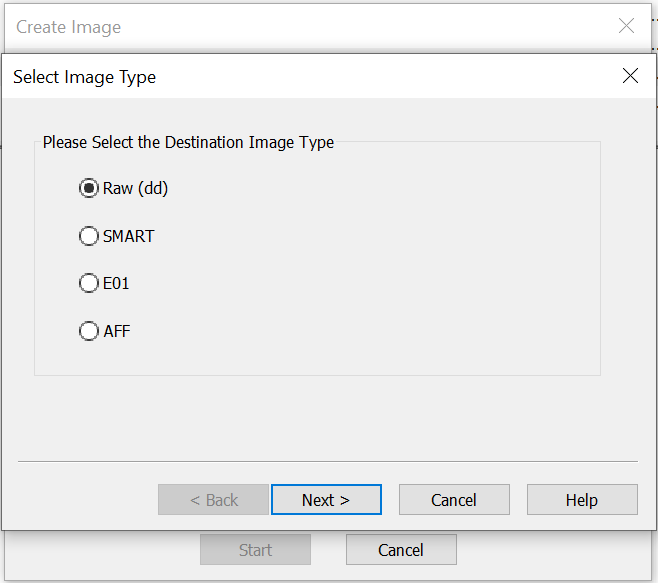
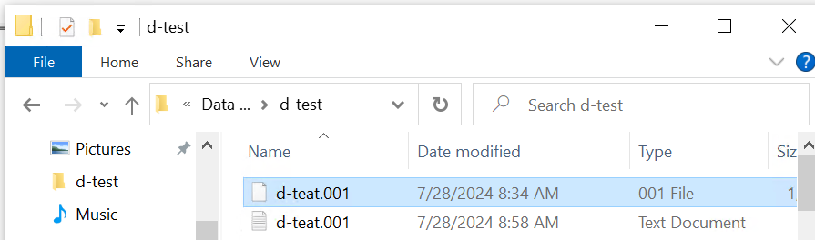
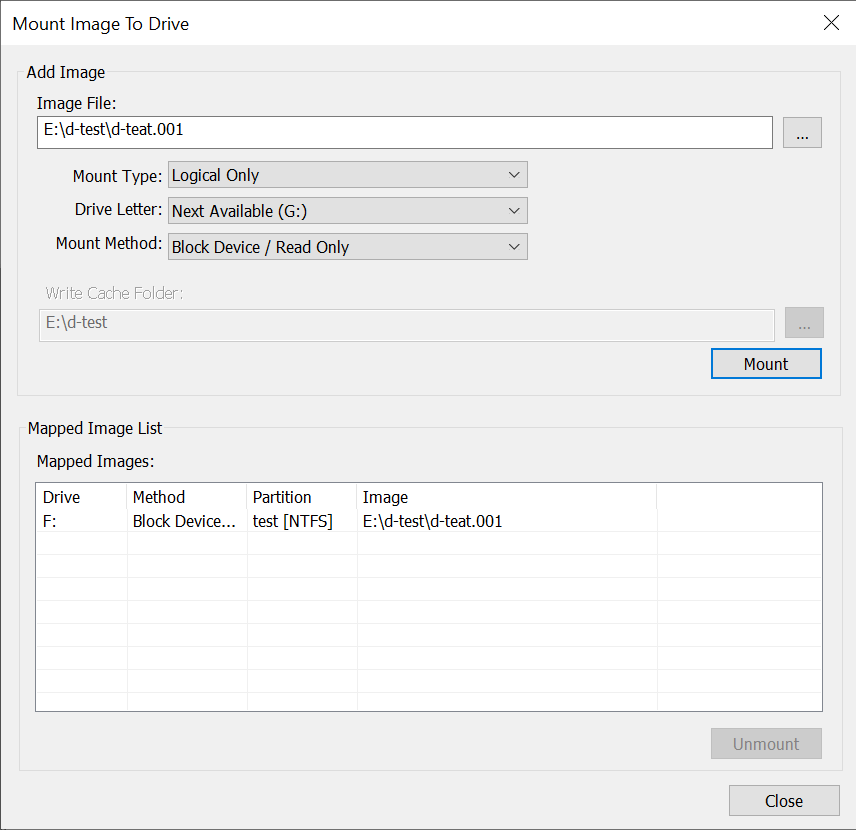
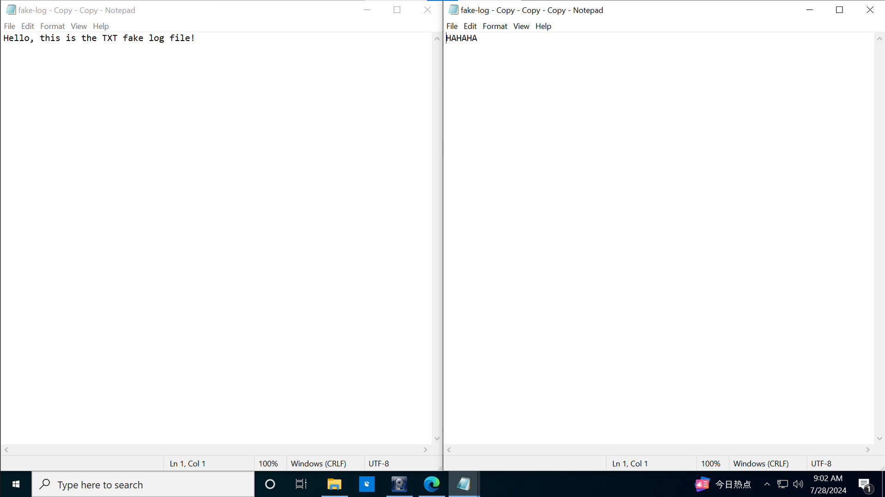
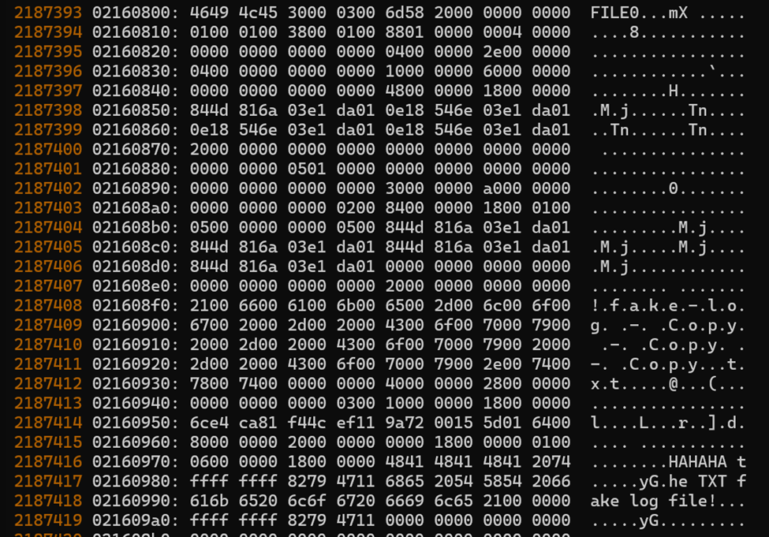

# NTFS-File-Recover

It's a tool to recover deleted file on NTFS with FTK Imager.

Recovery of large files (512 bytes or larger) is not supported.

FTK Imager can be replaced by any other application which can create Raw Images and mount the image as a logical volume.

Script is Windows Only.

## Usage

### Prepare

Install FTK Imager, and create a Raw-Type Image of the logical volume which your target file located.



Next, mount the Image as a logical volume.





In this example, the path of Raw Image is `E:\d-test\d-teat.001` and the target file is `F:\fake-log - Copy - Copy - Copy.txt`.

The original content of the file is shown in the left pane of the image below. I copied the file, modified the content and saved it.



### Run Scripts

Clone or download this project. Then change working directory into the project folder.

```bash
git clone https://github.com/juntong20XX/NTFS-File-Recover.git
cd NTFS-File-Recover
```

Next, use Python to execute the script. The only third-party module is `numpy`. Install it if `numpy` is not in your environment. No `numpy` version requirement, the version on my computer is `1.24.3`, you can reference this.

```bash
python -m NTFS_File_Recover -f $path_to_target_file -r $path_to_raw_image -o $path_to_output

# In this example:
path_to_target_file = 'F:\fake-log - Copy - Copy - Copy.txt'
path_to_raw_image = 'E:\d-test\d-teat.001'
path_to_output = 'output.txt'
```

You will most likely see a pop-up asking for the administrator permission. Click `Yes` because `fsutil` command request it. If not, the script will still listen the port for data, so you should cancel the Python process manually.

Finally, you can find the output file at `$path_to_output`. Since the script will still retain binary content such as NTFS end-of-file symbols, you may need a hex editor to open the output file.

Run `python -m NTFS-File-Recover --help` for more information.

### Troubleshooting

- `ValueError: too many values to unpack (expected 3)`

  This is because the file storage locations are not consecutive. This situation is beyond the scope of the program can handle.

- `ValueError` without more information

  The script failed to find target file by filename. Check your input. The script sets the cluster size to 4096 Bytes as default.[^1] Wrong size can also cause this problem.

- `OSError: [WinError 10048] Only one usage of each socket address ...`

  Unfortunately, the default port (7891) has been used by another program. Try again later or specify  a new port by `--port`.

- Antivirus/Firewall Warning

  The script will briefly listen on a local port for communication, please allow this network request.

- The program has not ended for a long time.

  Open the Task Manager and check the memory usage of the script. If the process usage is very low, there may be an error in the inter-process information transfer process. Kill the process and try to execute the script again.

## Development

The test scripts are named as `test_*`.

All project scripts can be found at `NTFS_File_Recover`.

NTFS is a journaling file system. This type of file system keeps tracking of the data's changes and records the changes to "journal".[^2] In NTFS, the "journal" is called *Master File Table* (MFT).

In a journaling file system, deleting a file does not cause the cluster (or block) where the file is stored to be cleared. Instead, the file location is marked as "deleted" in the journaling. Similarly, when a file is modified or overwritten, the file system will not actively clear the original data -- unless the location happens to be the location where the new data is saved. This is the theoretical basis of this project.

The following image in the hex data about the first example. You can find the new text "HAHAHA" at its lower right corner. And the string "TXT fake log file!" is the remnant of the old text.



Small directory records reside entirely within the MFT structure.[^3] We can get the offset to find the file location by using `fsutil` command.[^4][^5] In the image above, `46494c45` (the character `FTLE`) represents the start of a non-error MFT.[^6] Then the text cab be found bellow the symbol.

`file_offset.py` is used to get file displacement by calling `fsutil`. In most cases, the program is run as a non-administrator. This script provides the functionality to run as an administrator and send data through the socket. This project calls this function by default.

`raw_reader.py` provides functions for parsing Raw Images. Many of the parameters in the script are magic numbers that I have observed. In addition, `numpy` is required to find subsequence in this script.

`__init__.py` the entry of Python packages. It also provides `get_bytes` function for get remaining bytes.

`__main__.py` the entry script when call a Python module on a shell. It provides the argument parser, and the shell activities.

In the future:

- Test `fsutil` before ask administrator permissions.
- Remove `numpy` depend.

- Supports recovering large files.

## Reference

[^1]: NTFS Optimization, [https://www.ntfs.com/ntfs_optimization.htm](https://www.ntfs.com/ntfs_optimization.htm)
[^2]: Journaling file system, [https://en.wikipedia.org/wiki/Journaling_file_system](https://en.wikipedia.org/wiki/Journaling_file_system)
[^3]: NTFS Master File Table (MFT), [https://www.ntfs.com/ntfs-mft.htm](https://www.ntfs.com/ntfs-mft.htm)
[^4]:  Windows文件系统-NTFS文件系统, [https://www.cnblogs.com/eflypro/p/14362650.html](https://www.cnblogs.com/eflypro/p/14362650.html)
[^5]: fsutil WS Learn, [https://learn.microsoft.com/en-us/windows-server/administration/windows-commands/fsutil](https://learn.microsoft.com/en-us/windows-server/administration/windows-commands/fsutil)
[^6]: NTFS文件统MFT元文件, [https://www.pnpon.com/article/detail-60.html](https://www.pnpon.com/article/detail-60.html)
