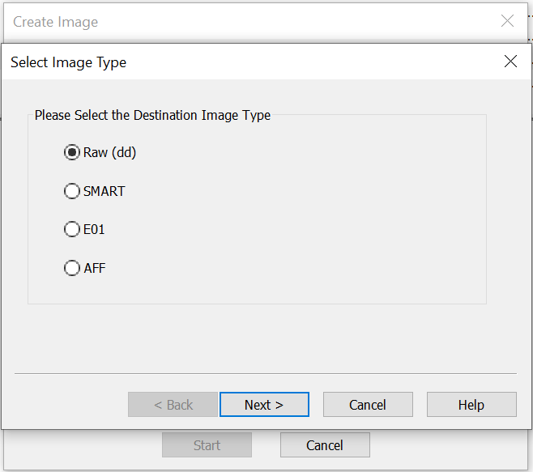
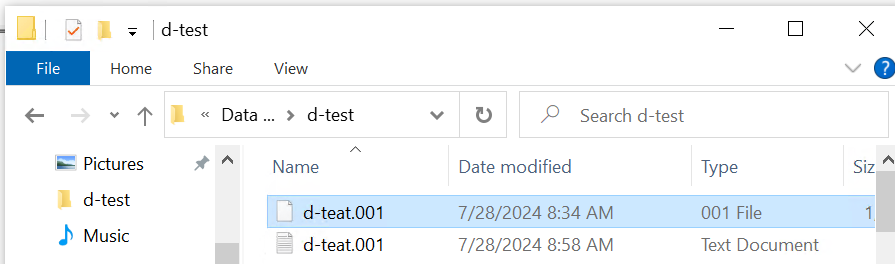
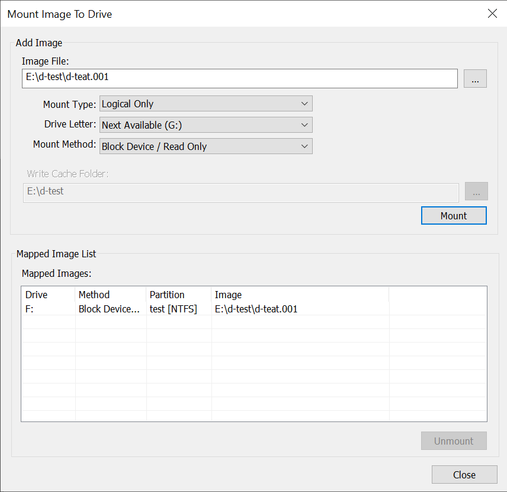
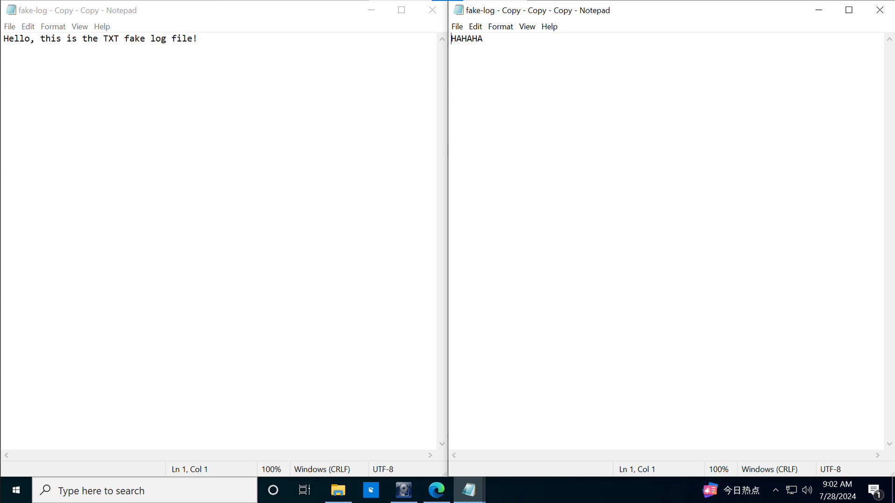

typora-copy-images-to: ./markdown images

# NTFS-File-Recover

It's a tool to recover deleted file on NTFS with FTK Imager.

FTK Imager can be replaced by any other application which can create Raw Images and mount the image as a logical volume.

## Usage

### Prepare

Install FTK Imager, and create a Raw-Type Image of the logical volume which your target file located.



Next, mount the Image as a logical volume.





In this example, the path of Raw Image is `E:\d-test\d-teat.001` and the target file is `F:\fake-log - Copy - Copy - Copy.txt`.

The original content of the file is shown in the left pane of the image below. I copied the file, modified the content and saved it.



### Run Scripts

Clone or download this project. Then change working directory into the project folder.

```bash
git clone https://github.com/juntong20XX/NTFS-File-Recover.git
cd NTFS-File-Recover
```

Next, use python to execute the script. The third-party module is `numpy`. Install it if `numpy` is not in your environment.

```bash
python -m NTFS-File-Recover -f $path_to_target_file -r $path_to_raw_image -o $path_to_output

# In this example:
path_to_target_file = 'F:\fake-log - Copy - Copy - Copy.txt'
path_to_raw_image = 'E:\d-test\d-teat.001'
path_to_output = 'output.txt'
```

## Development


## Future

Remove `numpy` depend.

Supports large files.
